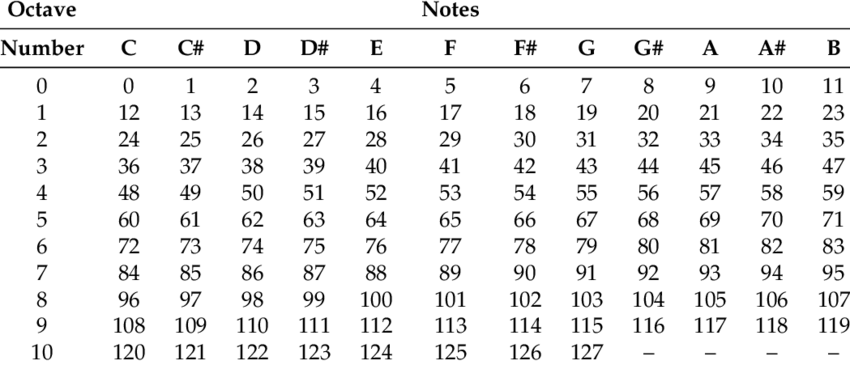

# Music Composer

A program that can generate simple homophonic music. It considers rules found in music theory and uses a [Markov chain] (https://en.wikipedia.org/wiki/Markov_chain) mathematical model to analyse the input composition and learn a pleasing order of notes to achieve a sensible short output composition. 
A personal assignment project for the Computer Based Sound Production Course at the University of Ljubljana, Faculty of Computer and Information Science. 
File *porocilo.pdf* contains a detailed report in the Slovenian language.

Developed with Java and IntelliJ IDEA. It uses Java Sound low-level API that contains a package for I/O, sequencing, and synthesis of MIDI data.

In the current version, the input composition must be manually written as notes according to the [MIDI tuning standard](https://en.wikipedia.org/wiki/MIDI_tuning_standard) in the controlling variables in the main *Composer.java* file. See the provided table bellow. Two sample pieces are already provided in the source code: Howard Shore's Concerning Hobbits and Marry Had a Little Lamb.

